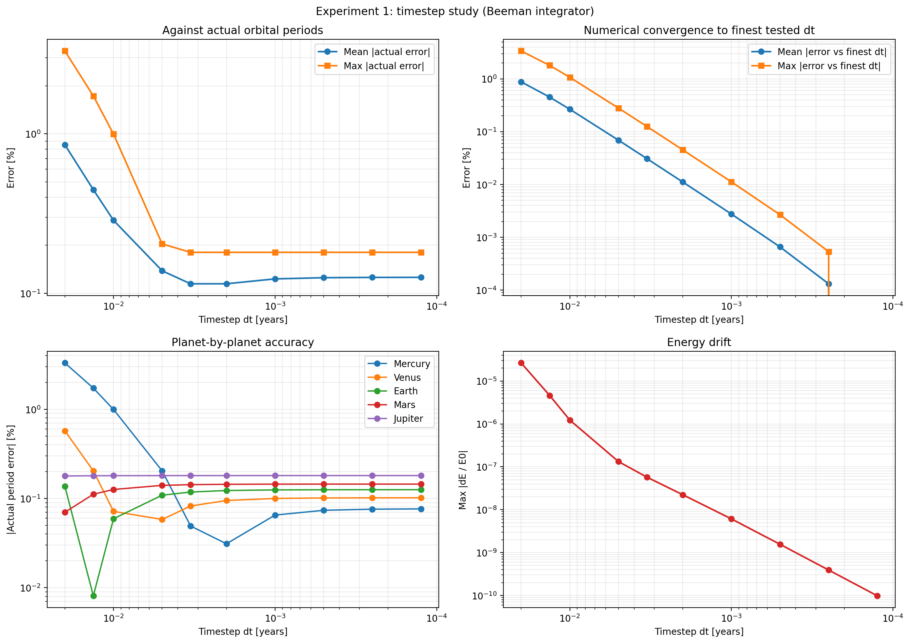
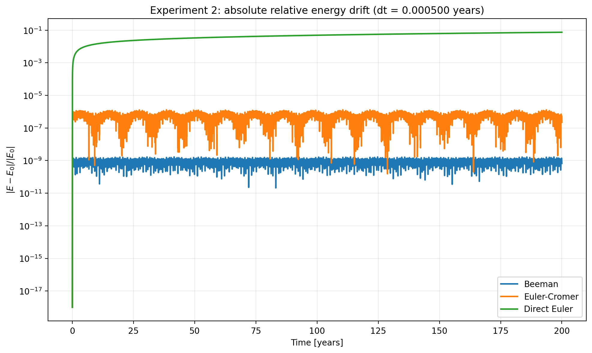
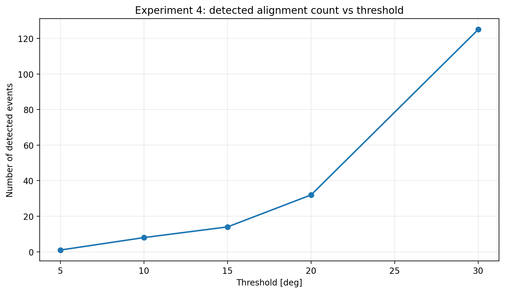

# Solar System Simulation

A many-body Solar System simulation written in Python for a Computer Simulation project.
The model simulates the Sun, Mercury, Venus, Earth, Mars, and Jupiter in two dimensions and compares different numerical integration methods.

## Overview

This project investigates three main questions:

1. How accurately can the simulation reproduce the orbital periods of the planets?
2. How well do different numerical integrators conserve total energy over long times?
3. How often do five-planet alignments occur under a mean-angle alignment criterion?

The codebase is fully object-oriented and uses one shared simulation core for the default run and all experiments.

## Numerical methods used

- **Beeman**
- **Euler-Cromer**
- **Direct Euler**

## Experiments completed

### Experiment 1 - Orbital periods
The simulated orbital periods of Mercury, Venus, Earth, Mars, and Jupiter were compared against NASA sidereal values.

Key result:
- All five planets were reproduced with **sub-percent error**.
- The timestep study showed clear numerical convergence.
- Beyond a certain point, reducing the timestep further gave diminishing returns because modelling assumptions dominated the remaining error.

### Experiment 2 - Energy conservation
The long-term energy behaviour of Beeman, Euler-Cromer, and Direct Euler was compared.

Key result:
- **Beeman** gave the best long-term energy conservation.
- **Euler-Cromer** remained bounded but was less accurate.
- **Direct Euler** showed strong secular drift and was unsuitable for accurate long-term orbital simulation.

### Experiment 4 - Planetary alignment
Five-planet alignments were detected using a **mean-angle criterion** with multiple angular thresholds.

Key result:
- Under a strict **5 deg** threshold, alignments were extremely rare.
- Relaxing the threshold produced many more events.
- The intervals between events were irregular rather than periodic.

## Example results

### Experiment 1: timestep study


### Experiment 2: energy drift comparison


### Experiment 4: alignment count vs threshold


## Project structure

```text
data/
runs/
solar_sim/
docs/
README.txt
README.md
solar-system-simulations-report.pdf
```
